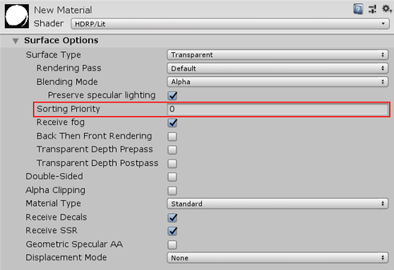

# Material rendering priority

HDRP uses Material rendering priority settings to sort transparent GameObjects.

The built-it Unity render pipeline sorts GameObjects according to their **Rendering Mode** and render queue. HDRP uses the render queue in a different way, in that HDRP Materials do not expose the render queue directly. Instead, Materials with a **Transparent Surface Type** have a **Sorting Priority** property:

HDRP uses this priority to sort GameObjects using different Materials in your Scene. HDRP renders Materials with lower **Sorting Priority** values first. This means that Meshes using Materials with a higher **Sorting Priority** value appear in front of those using Materials with lower ones, even if Meshes using the first Material are further away from the Camera.

For example, the following Scene includes two spheres (**Sphere 1** and **Sphere 2**) that use two different Materials. As you can see, **Sphere 1** is closer to the **Camera** than **Sphere 2**.

Setting the **Sort Priority** of both Spheres' Materials to **0** results in HDRP rendering them in an order defined by their distance from the Camera. When the **Sort Priority** properties of different Materials are the same, HDRP treats them as of equal importance, setting the rendering order based on the Mesh's depth in the screen. In the example case, this means that **Sphere 1** appears in front of **Sphere 2**.

Setting the **Sort Priority** of **Sphere 2**'s Material to **1** results in HDRP rendering the spheres in an order defined by their **Sort Priority**. When the **Sort Priority** properties of different Materials are not the same, HDRP displays Meshes using Materials with a higher priority in front of those using Materials with a lower Priority. To achieve this, HDRP draws Meshes using lower priority Materials first and draws Meshes using the higher priority Materials later, on top of the meshes HDRP drew previously. In the example case, this means that HDRP renders **Sphere 1** first, then renders **Sphere 2** (drawing it over **Sphere 1**). This makes **Sphere 2** appear in front of **Sphere 1** despite **Sphere 1** being closer to the **Camera**.

